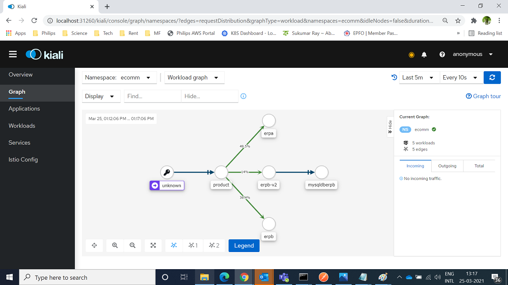

# Stage-3

## Objective

Upgrade ERB-B v2 to use a MySQL database

More product details are maintained in the MySQL database - B0001 to B004 and C0001 to C0008 (check script .\mysqldb-erp-B\setup.sql)

## Steps

1. Added MySQL DB - using mariadb:latest ; check mysqldb-erp-B 

2. ecoom.yaml -> Added deployment and service mysqldberpb

3. ecomm-destinationrules.yaml -> Added destination rule mysqldberpb

4. ecomm-virtualservice.yaml -> Add Virtual Service mysqldberpb 

6. As before in stage-2, we can test with only v2 (ecomm-virtualservice-erpb-v2.yaml), or traffic split between v1 and v2 (ecomm-virtualservice-erpb-v1-v2.yaml)

### Verification 

Traffic split verified in Kiali & Grafana

 
