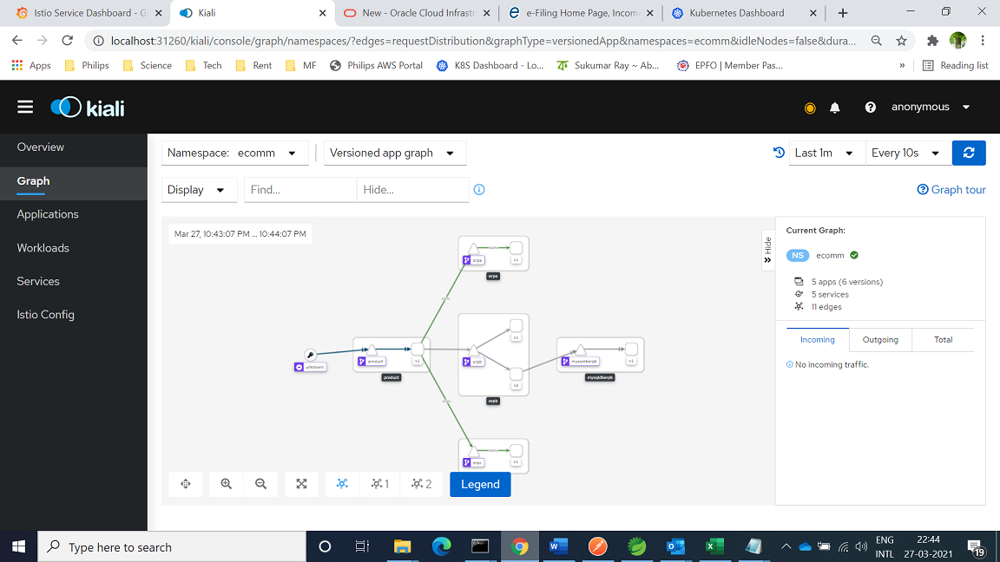

# Stage-4

## Objective

Test gRPC. We add a new ERP C , which exposes gRPC API for product details.

So our Product API now combines call across 3 kernels - erp-A (http), erp-B-v2 (http) and erp-C (gRPC) 

## Steps

1. Implement erp-C : a gRPC server implemented with gradle protobuf integration 
 
- Check gRPC sevice definition under .\erp-C\src\main\proto\product.proto
- Run "gradle clean build" -> generates gRPC Java code under build/generated/source/proto/main/grpc and build/generated/source/proto/main/

2. Extend Product API (under ./product).
  - It makes gRPC call (client) to erp-C -> check code .\product\src\main\java\com\example\ProductService.java & ERPC_Client.java

3. ecomm.yaml -> Added erp-C (Deployment & Service)

4. ecomm-destinationrules.yaml -> Add erpc

4. ecomm-virtualservice.yaml -> Add erpc

5. Create destination rules - ecomm-destinationrules.yaml ; still round robin

6. Create all virtual services - ecomm-virtualservice.yaml
- Note:  erp-B v1 is no longer used, the VirtualService uses v2  (product codes maintained in MySQL DB)

7. To verify gRPC performance, make calls to product API , looking up same number of product codes from erp-A (product codes "A000*")  and erp-C (product codes "D0000*")
- Check Grafana service dashboard results for erpa and erpc
- 
### Verification

Traffic split verified in Kiali graph -> traffic is diected to erpa, erpb-v2 and erp-C

 
